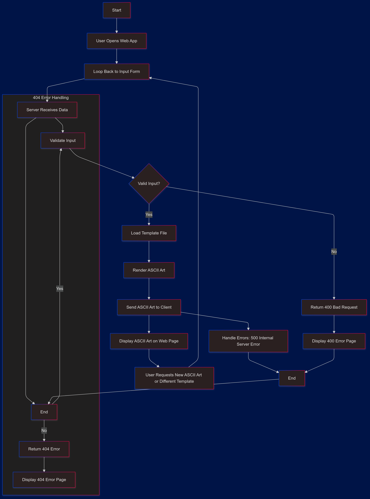

# ascii-art-web

## ASCII Art Generator

An ASCII Art Generator built using Go that allows users to input text and generate ASCII art using different templates. The generator supports three ASCII art templates: standard, shadow, and thinkertoy.

### Features

Input any text and generate ASCII art representations.
Choose from three available templates: standard, shadow, and thinkertoy.
Handle errors gracefully with custom error pages for 404 and 400 status codes.
Built with Go's standard library.
Simple web interface to generate and display ASCII art.

```
**Project Structure**

ascii-art-generator/
│
├── ascii/ # Go code for generating ASCII art
│ ├── ascii.go # Functions for ASCII art generation
│ └── templates/ # Template files for rendering ASCII art
│ ├── standard.txt # Template for "standard" style
│ ├── shadow.txt # Template for "shadow" style
│ └── thinkertoy.txt # Template for "thinkertoy" style
│
├── templates/ # HTML templates
│ ├── index.html # Main webpage for user input
│ ├── 400.html # Custom error page for Bad Request (400)
│ ├── 404.html # Custom error page for Not Found (404)
│ └── 500.html # Custom error page for Internal Server Error (500)
├── main.go # Main Go file to run the server
└── README.md # This README file
```

### Installation

```
Clone the repository:

git clone https://github.com/yourusername/ascii-art-generator.git
cd ascii-art-generator
Install the Go dependencies (if any):

go mod tidy
Run the server:

go run main.go
Open your browser and visit http://localhost:8080 to access the ASCII Art Generator.

```

### Usage

```
Open the web page (http://localhost:8080).
Enter the text you want to convert into ASCII art in the text box.
Choose a template (standard, shadow, or thinkertoy).
Click the "Submit" button to generate the ASCII art.
The resulting ASCII art will be displayed below the form.
```

### Error Handling

```
The project includes custom error pages for various HTTP status codes:

404.html: Displays when navigating to an invalid URL.
400.html: Displays when an invalid input (e.g., unsupported characters) is detected.
500.html: Displays when an internal server error occurs.
These HTML error pages are located in the templates/ directory and are used for respective HTTP error statuses.
```

```



```
